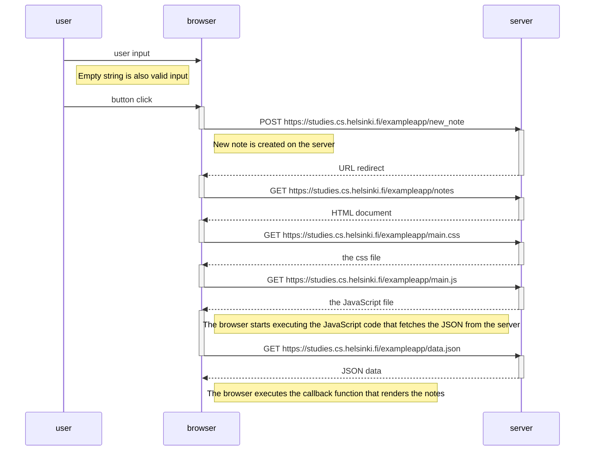

```mermaid
sequenceDiagram
    participant user
    participant browser
    participant server

    user->>browser: user input
    Note right of user: Empty string is also valid input

    user->>browser: button click

    activate browser
    browser->>server: POST  https://studies.cs.helsinki.fi/exampleapp/new_note
    deactivate browser
    activate server
    Note right of browser: New note is created on the server
    server-->>browser: URL redirect
    deactivate server

    activate browser
    browser->>server: GET https://studies.cs.helsinki.fi/exampleapp/notes
    deactivate browser
    activate server
    server-->>browser: HTML document
    deactivate server

    activate browser
    browser->>server: GET https://studies.cs.helsinki.fi/exampleapp/main.css
    deactivate browser
    activate server
    server-->>browser: the css file
    deactivate server

    activate browser
    browser->>server: GET https://studies.cs.helsinki.fi/exampleapp/main.js
    deactivate browser
    activate server
    server-->>browser: the JavaScript file
    deactivate server

    activate browser
    Note right of browser: The browser starts executing the JavaScript code that fetches the JSON from the server
    browser->>server: GET https://studies.cs.helsinki.fi/exampleapp/data.json
    deactivate browser
    activate server
    server-->>browser: JSON data
    deactivate server

    Note right of browser: The browser executes the callback function that renders the notes
```
