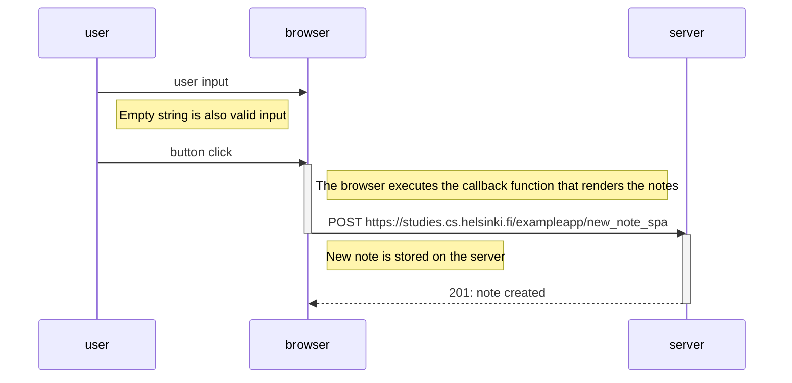

```mermaid
sequenceDiagram
    participant user
    participant browser
    participant server

    user->>browser: user input
    Note right of user: Empty string is also valid input

    user->>browser: button click

    activate browser
    Note right of browser: The browser executes the callback function that renders the notes
    browser->>server: POST https://studies.cs.helsinki.fi/exampleapp/new_note_spa
    deactivate browser
    activate server
    Note right of browser: New note is stored on the server
    server-->>browser: 201: note created
    deactivate server
```
