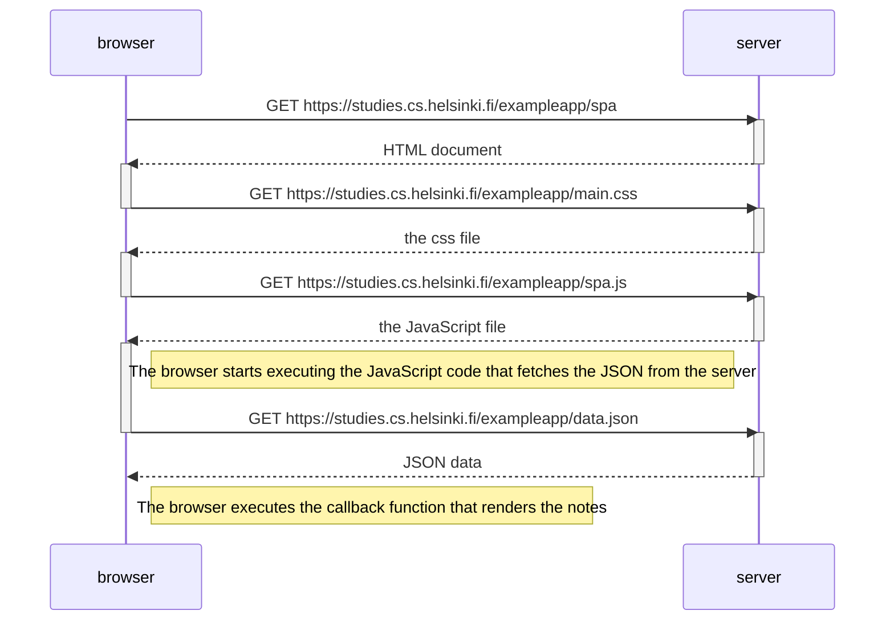

```mermaid
sequenceDiagram
    participant browser
    participant server

    browser->>server: GET https://studies.cs.helsinki.fi/exampleapp/spa
    activate server
    server-->>browser: HTML document
    deactivate server

    activate browser
    browser->>server: GET https://studies.cs.helsinki.fi/exampleapp/main.css
    deactivate browser
    activate server
    server-->>browser: the css file
    deactivate server

    activate browser
    browser->>server: GET https://studies.cs.helsinki.fi/exampleapp/spa.js
    deactivate browser
    activate server
    server-->>browser: the JavaScript file
    deactivate server

    activate browser
    Note right of browser: The browser starts executing the JavaScript code that fetches the JSON from the server
    browser->>server: GET https://studies.cs.helsinki.fi/exampleapp/data.json
    deactivate browser
    activate server
    server-->>browser: JSON data
    deactivate server

    Note right of browser: The browser executes the callback function that renders the notes
```
